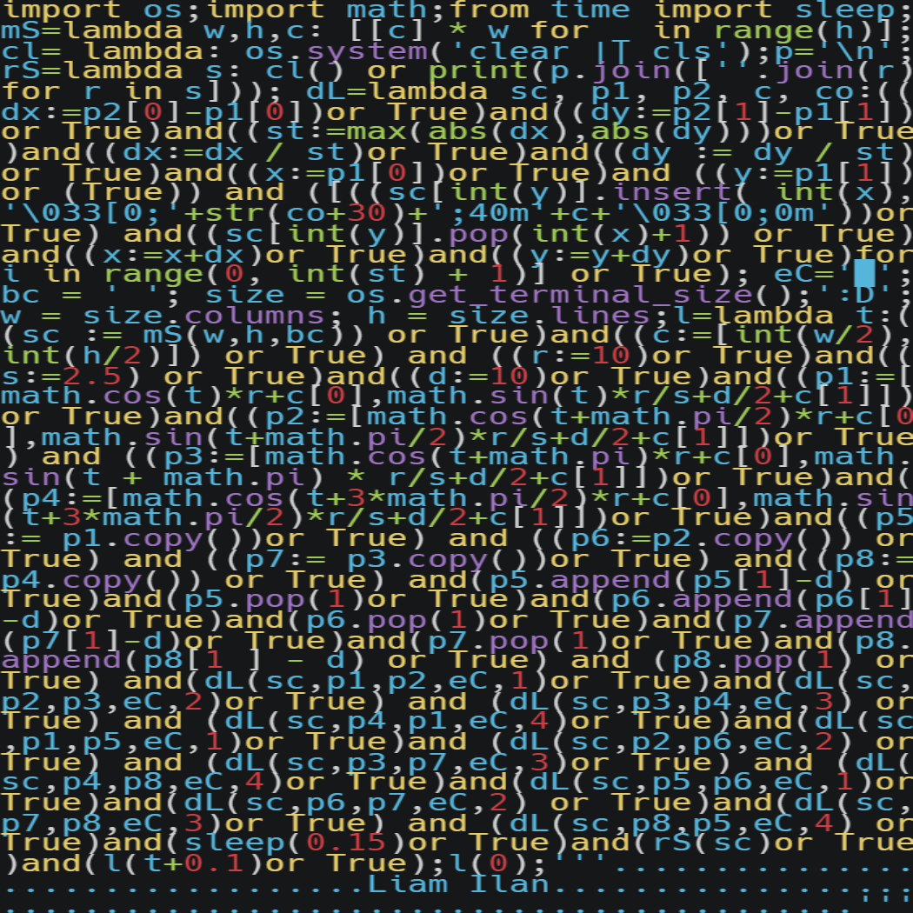
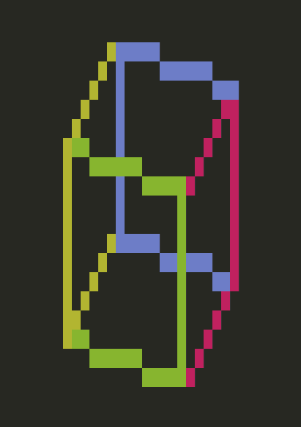

# Python Cube
A cube wireframe renderer, in a 45x45 Python script, inspired by [donut.c](https://www.a1k0n.net/2006/09/15/obfuscated-c-donut.html).

An Interactive version can be found [here](https://replit.com/@snowboardsheep/Python-Cube?v=1).
## Images
| Code, Adjusted to Fit Into a Square    | Output                              |
|----------------------------------------|-------------------------------------|
|  |  |

### Development
Run with `python cube.py`
- The obfuscated code can be found in `cube.py`.
- The unobfuscated version can be found at in `unobfuscated-cube.py`
- The one liner version can be found at in `one-liner.py`

## Author
[Liam Ilan](https://github.com/liam-ilan)